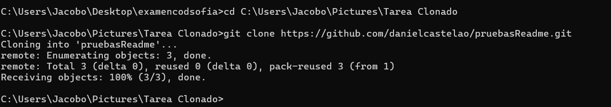

Tarea de clonado 
# Tarea de Clonado de Repositorio

Este documento explica cómo realicé el proceso de clonado de un repositorio usando Git.

## Pasos realizados

1. **Cambio de directorio:**
    - Primero, me aseguré de moverme al directorio donde quería clonar el repositorio. Usé el comando:
      ```bash
      cd C:\Users\Jacobo\Pictures\Tarea Clonado
      ```
    - Esto me llevó a la carpeta `Tarea Clonado`, ubicada dentro de `Pictures`.

2. **Clonado del repositorio:**
    - Luego, utilicé el comando `git clone` para clonar el repositorio remoto desde GitHub. El comando que ejecuté fue:
      ```bash
      git clone https://github.com/danielcastelao/pruebasReadme.git
      ```
    - Esto descargó todos los archivos del repositorio remoto llamado `pruebasReadme` en mi máquina local.

3. **Resultados del comando:**
    - Git me mostró los siguientes mensajes indicando que el clonado fue exitoso:
        - *Enumerating objects...*: Se identificaron todos los archivos del repositorio.
        - *Receiving objects...*: Se completó la descarga de los archivos al 100%.

4. **Resultado final:**
    - El repositorio `pruebasReadme` ahora está disponible en mi carpeta local, dentro de la ruta:
      ```
      C:\Users\Jacobo\Pictures\Tarea Clonado\pruebasReadme
      ```


---

¡Ahora ya tengo todo listo para trabajar con los archivos del repositorio clonado! 😊

